# Detection Engineering and Response Lab

A self-built Security Operations Center environment generating live, real-time telemetry rather than pre-recorded log imports. The lab covers a full detection-to-response pipeline including endpoint monitoring, SIEM correlation, threat hunting, SOAR automation, and analyst-facing alert delivery.

## TL;DR

- Deployed Wazuh SIEM and Sysmon endpoint monitoring and generated evidence through controlled adversary emulation rather than sample datasets.
- Built and validated a Wazuh → Shuffle → VirusTotal → Slack detection-to-response pipeline.
- Investigated ATT&CK-mapped activity across credential access, persistence, command execution, PowerShell, and obfuscated command-line behavior.
- Identified the difference between telemetry visibility and detection logic, including a Scheduled Task persistence gap where raw Sysmon evidence was stronger than the default Wazuh alert mapping.
- Diagnosed and repaired both a broken Wazuh manager configuration and a later SOAR integration failure during live investigation work, then proved recovery through successful end-to-end retesting.

---

## Architecture

```text
[ Adversary Emulation ]             [ Windows 11 Victim ]              [ Ubuntu, Wazuh Manager ]
  Mimikatz / Atomic Red Team   ---> Sysmon + Wazuh Agent        ---> Wazuh SIEM
  Encoded PowerShell                 192.168.10.21                     192.168.10.10
                                                                                |
                                                                                v
                                                                        [ Shuffle SOAR ]
                                                                     VirusTotal enrichment
                                                                                |
                                                                                v
                                                                        [ Slack SOC Alert ]
```

**Network design:** the lab uses a VirtualBox dual-adapter setup. One adapter provides NAT internet access, while a dedicated Internal Network (`SOC-lab`) carries VM-to-VM SIEM traffic.

---

## Tech Stack

| Layer | Tool |
|---|---|
| SIEM | Wazuh 4.9.0, Docker single-node deployment |
| Endpoint telemetry | Sysmon with SwiftOnSecurity configuration |
| SOAR | Shuffle |
| Threat intelligence | VirusTotal API |
| Alert delivery | Slack |
| Adversary emulation | Mimikatz, Atomic Red Team, controlled PowerShell testing |
| Virtualization | VirtualBox |
| Endpoints | Ubuntu, Windows 11 Enterprise LTSC

---

# Investigation 1 — Credential Access Attempt and Threat Hunting Pivot

## Executive Summary

A simulated LSASS credential access attempt using Mimikatz was first intercepted by Windows Defender's script content detection. A subsequent x64 Mimikatz attempt launched but did not complete credential extraction, returning LSA memory-handle errors.

Rather than treating the blocked attempt as a failed scenario, the investigation pivoted into surrounding endpoint telemetry. That hunt surfaced two additional ATT&CK-mapped findings: Application Shimming activity involving `sdbinst.exe` and a PowerShell-related Ingress Tool Transfer detection.

These findings are documented as activity observed during the investigation window and are not presented as confirmed consequences of the Mimikatz attempt.

## Timeline

| Sequence | Event |
|---|---|
| T+0 | `Sysmon64` and `WazuhSvc` confirmed running |
| T+1 | Mimikatz execution attempted with `sekurlsa::logonpasswords` |
| T+1 | Windows Defender blocks the script-based invocation |
| T+2 | x64 Mimikatz launches, but credential extraction does not complete |
| T+3 | Threat hunt begins in Wazuh Discover |
| T+3 | `sdbinst.exe` activity is surfaced and mapped to Application Shimming |
| T+4 | PowerShell file-transfer activity is surfaced and mapped to Ingress Tool Transfer |
| T+5 | Wazuh manager connectivity fails during investigation and is recovered |

## Detection Evidence

**Pre-attack service verification**  
[View service verification](images/scenario1/s1_01_services_running.png)

**Blocked credential-access attempt**

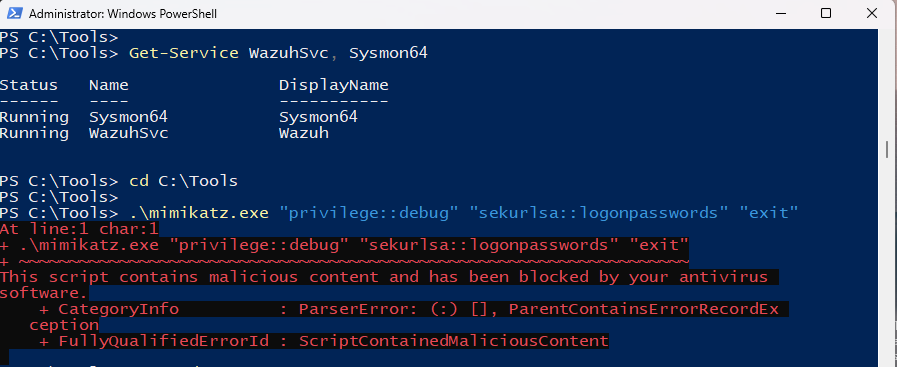

[View x64 Mimikatz execution attempt](images/scenario1/s1_02b_mimikatz_x64_attempt.png)

### Finding 1 — Application Shimming, T1546.011

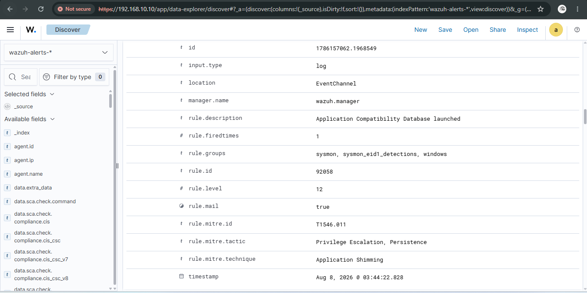

Wazuh Rule ID `92058`, Severity `12`, mapped the observed `sdbinst.exe` activity to Application Shimming.

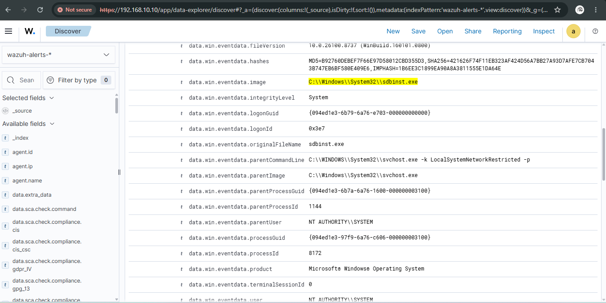

The expanded event preserved process, parent-process, integrity-level, and hash context for analyst review.

### Finding 2 — Ingress Tool Transfer, T1105

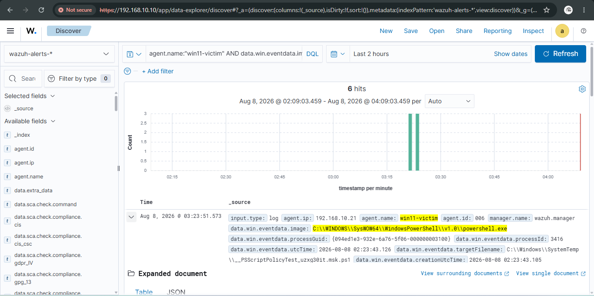

The hunt surfaced PowerShell writing an executable into `C:\Windows\SystemTemp\`.

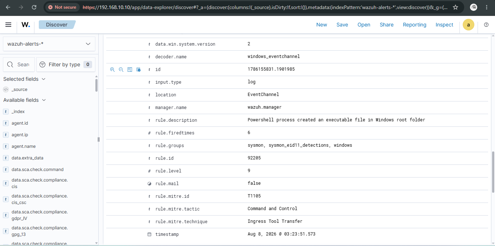

Wazuh Rule ID `92205`, Severity `9`, mapped the activity to Ingress Tool Transfer.

**Sustained live telemetry**  
[View raw telemetry volume](images/scenario1/s1_08_raw_telemetry_volume.png)

More than 1,200 events across the observed period demonstrated sustained endpoint collection rather than a single generated alert.

## Root Cause Analysis — Wazuh Manager Recovery

During the investigation, the Windows agent stopped reporting and began receiving connection refusals from the manager on port `1514`.

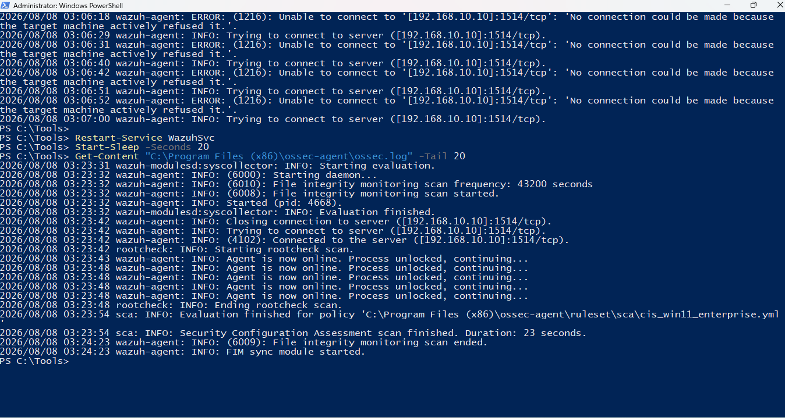

**Diagnosis:** a malformed `ossec.conf` prevented `wazuh-db` from starting correctly, leaving the manager without its expected `queue/db/wdb` socket and disrupting agent-to-manager communication.

**Resolution:** the manager configuration was repaired, the database socket restored, affected Wazuh components restarted, and Windows telemetry confirmed online again without rebuilding the lab.

## ATT&CK Coverage — Scenario 1

| Technique ID | Technique | Tactic | Evidence |
|---|---|---|---|
| T1003.001 | OS Credential Dumping: LSASS Memory | Credential Access | Mimikatz `sekurlsa::logonpasswords` attempted; no successful extraction claimed |
| T1546.011 | Application Shimming | Persistence, Privilege Escalation | Wazuh Rule 92058 and `sdbinst.exe` telemetry |
| T1105 | Ingress Tool Transfer | Command and Control | Wazuh Rule 92205 and PowerShell file-write telemetry |

## Analyst Takeaway

A blocked attack is not a failed investigation. The scenario reinforced two analyst habits: continue hunting around the failed technique, and distinguish correlation from causation when multiple alerts appear in the same time window.

---

# Investigation 2 — Scheduled Task Persistence, T1053.005

## Executive Summary

Scenario 2 tested Windows Scheduled Task persistence using Atomic Red Team technique `T1053.005`. The objective was to prove the behavior through the complete evidence chain rather than treating successful command execution as the end of the test.

Atomic Red Team test number 1 completed successfully and created two scheduled tasks named `T1053_005_OnLogon` and `T1053_005_OnStartup`. Sysmon and Wazuh preserved the full `schtasks.exe` process telemetry, including the startup trigger, SYSTEM execution context, and `cmd.exe /c calc.exe` action.

The investigation also surfaced Wazuh Rule ID `92052`, Level `4`, mapped to `T1059.003` Windows Command Shell. This is documented as supporting execution-chain evidence rather than a direct Scheduled Task alert.

## Test Preparation

[View Atomic Red Team module ready](images/scenario2/s2_01_atomic_module_ready.png)

[View T1053.005 test catalog](images/scenario2/s2_02_t1053_005_test_catalog.png)

[View Wazuh and Sysmon services running](images/scenario2/s2_03_services_running_pretest.png)

[View Wazuh pretest baseline](images/scenario2/s2_04_wazuh_dashboard_pretest_baseline.png)

## Attack Simulation

Atomic Red Team T1053.005 test number 1 was executed from an elevated PowerShell session and returned Exit Code `0`.

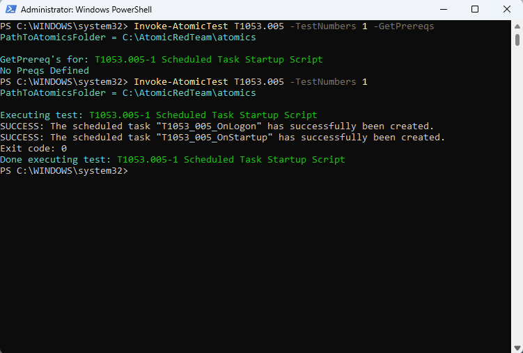

## Threat Hunting

The investigation pivoted into Wazuh Discover and reviewed PowerShell parent-process activity surrounding the simulation.

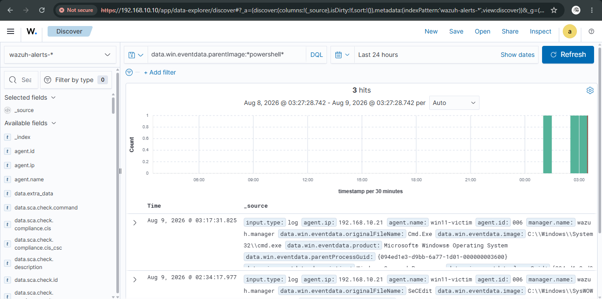

### Related Wazuh Detection — T1059.003

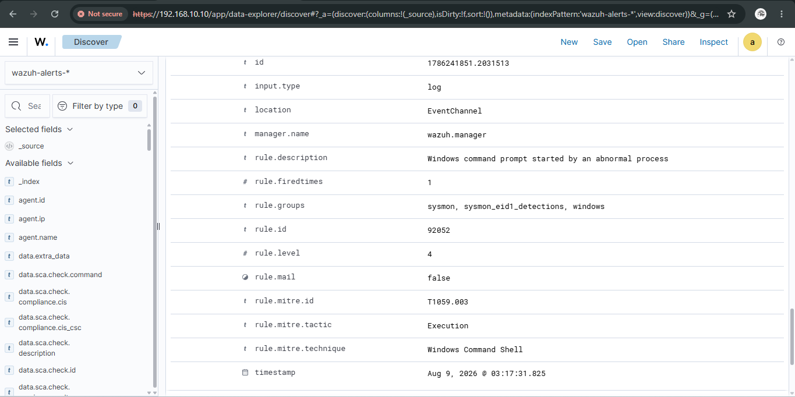

Rule ID `92052` identified abnormal Windows command-shell activity. It supports the execution chain but is not treated as proof of a native Wazuh T1053.005 alert.

## Definitive Telemetry

The strongest evidence came from Sysmon process creation telemetry ingested into Wazuh.

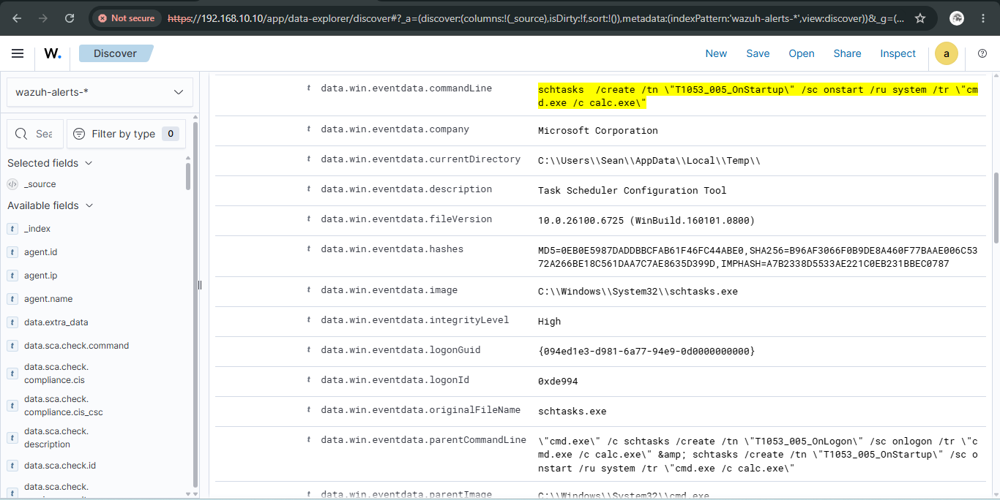

The event records `C:\Windows\System32\schtasks.exe` and preserves the command used to create `T1053_005_OnStartup`, including `/sc onstart`, `/ru system`, and `cmd.exe /c calc.exe`. The parent command line also exposes the creation sequence for both Atomic Red Team tasks.

## Detection Engineering Finding

Scenario 2 exposed a useful detection gap. Visibility was present, but the default alert observed during the test mapped supporting command-shell activity instead of directly promoting the scheduled-task creation behavior into a T1053.005 persistence alert.

A custom detection could inspect Sysmon process creation for `schtasks.exe` combined with `/create`, then raise confidence when the command also contains persistence-oriented triggers such as `onstart` or `onlogon`, SYSTEM execution, or an unusual task action.

This is a **detection-logic gap, not a telemetry gap**.

## Incident Timeline

| Stage | Event |
|---|---|
| Preparation | Atomic Red Team module confirmed available and T1053.005 catalog reviewed |
| Baseline | Endpoint services and Wazuh state verified |
| Simulation | T1053.005 test number 1 executed successfully |
| Persistence | `T1053_005_OnLogon` and `T1053_005_OnStartup` created |
| Hunting | Parent-process activity reviewed in Wazuh Discover |
| Related detection | Wazuh Rule 92052 generated a T1059.003 Windows Command Shell event |
| Telemetry | Sysmon exposed `schtasks.exe`, task names, trigger, SYSTEM context, action, and parent command line |
| Finding | Raw telemetry proved the persistence behavior while default detection logic left room for improvement |

## ATT&CK Coverage — Scenario 2

| Technique ID | Technique | Tactic | Evidence |
|---|---|---|---|
| T1053.005 | Scheduled Task/Job: Scheduled Task | Execution, Persistence, Privilege Escalation | Atomic execution plus Sysmon `schtasks.exe` process telemetry |
| T1059.003 | Windows Command Shell | Execution | Wazuh Rule 92052, Level 4 |

## Analyst Takeaway

Raw endpoint telemetry can be stronger than the alert label attached to it. Scenario 2 moved from attack simulation into detection engineering by identifying exactly where better rule logic could turn existing visibility into a higher-confidence persistence alert.

---

# Investigation 3 — Encoded PowerShell, Detection and SOAR Recovery

## Executive Summary

Scenario 3 tested whether the lab could identify PowerShell execution containing a Base64-encoded command, preserve enough telemetry for analyst reconstruction, and complete the response path from endpoint activity through Wazuh and Shuffle into Slack.

A benign PowerShell payload was encoded and executed with `powershell.exe -NoProfile -EncodedCommand`. The endpoint successfully produced Sysmon process-creation telemetry, and Wazuh preserved the full command line. During hunting, Wazuh Rule ID `92057`, Level `3`, identified the PowerShell process and mapped it to MITRE ATT&CK `T1059.001` PowerShell.

The encoded command itself demonstrates command-line obfuscation in the test activity. The default Wazuh event observed during this scenario was mapped to PowerShell execution rather than a separate T1027 alert, so the repository intentionally distinguishes **observed obfuscation behavior** from **the ATT&CK technique assigned by the Wazuh rule**.

The second half of the investigation became an operational recovery exercise. The Wazuh-to-Shuffle integration was verified, `wazuh-integratord` was confirmed running, the scenario was retested, Shuffle received the Wazuh Rule 92057 alert, and the workflow successfully delivered the SOC alert into Slack.

## Baseline Verification

Before generating the test event, endpoint telemetry was verified in Wazuh so the scenario began from a known-good collection state.

[View baseline telemetry verification](images/scenario3/s3_01_baseline_telemetry_verified.png)

## Attack Simulation — Encoded PowerShell

A harmless command was converted to Base64 and passed to PowerShell through `-EncodedCommand`. The purpose was not payload execution complexity; it was to create realistic command-line telemetry for a defense-evasion-oriented hunt while keeping the test safe and attributable.

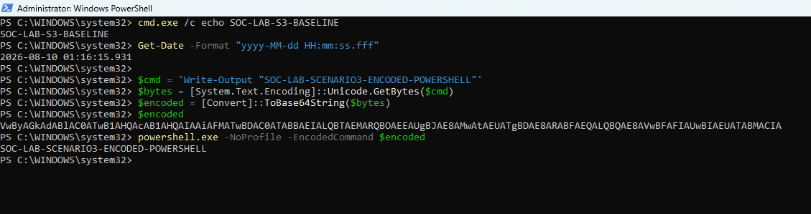

The terminal output confirmed successful execution of the lab payload.

## Threat Hunting Process

The investigation moved into Wazuh Discover and searched for encoded PowerShell activity on the Windows victim.

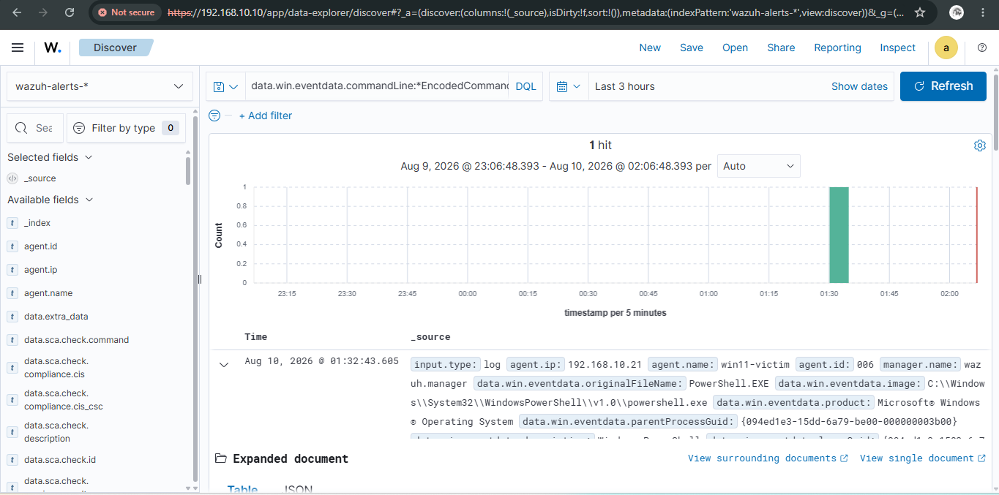

The event set showed `powershell.exe` activity containing the encoded command-line argument. This provided the first SIEM-side confirmation that endpoint telemetry had captured the simulation.

### Command-Line Reconstruction

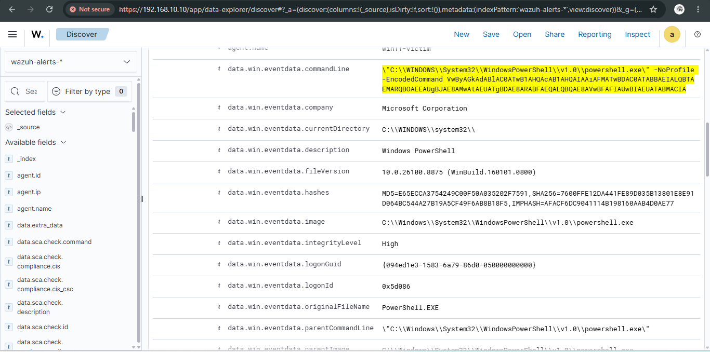

The expanded Wazuh record preserved the PowerShell image and command line, including the `-EncodedCommand` argument and Base64 data. This is the key analyst artifact for recognizing that the process used an encoded command rather than ordinary interactive PowerShell.

### Sysmon Process Creation Detail

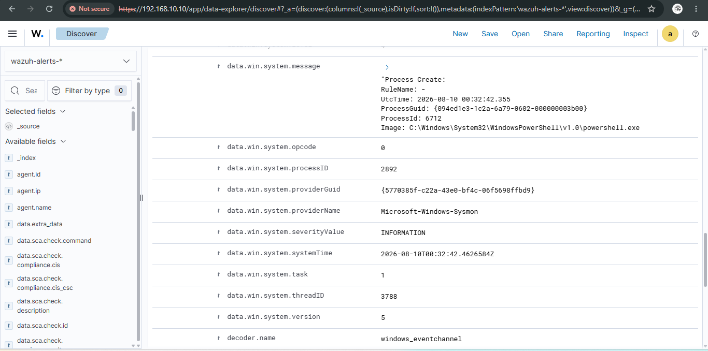

The Sysmon event provided process-level context for the execution, allowing the analyst to validate the executable, command line, user/process relationship, and surrounding metadata rather than relying only on a dashboard summary.

## Wazuh Detection — PowerShell, T1059.001

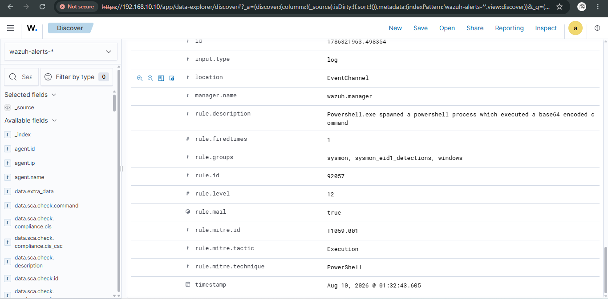

Wazuh Rule ID `92057`, Level `3`, described the event as a PowerShell process and mapped it to MITRE ATT&CK `T1059.001` under the Execution tactic.

This mapping is represented exactly as observed. Although the scenario deliberately used Base64 encoding and therefore demonstrated an obfuscation pattern in the command line, the captured Wazuh rule was a PowerShell execution detection rather than an explicit T1027 detection.

## SOAR Integration Validation and Recovery

The investigation then moved beyond endpoint detection to validate the downstream response pipeline.

### Wazuh Integration Loaded

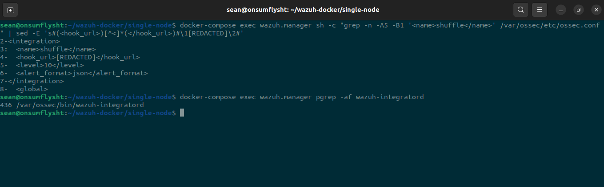

The Wazuh integration configuration was confirmed present inside the manager container with the Shuffle integration enabled for qualifying JSON alerts.

### Integrator Service Verification

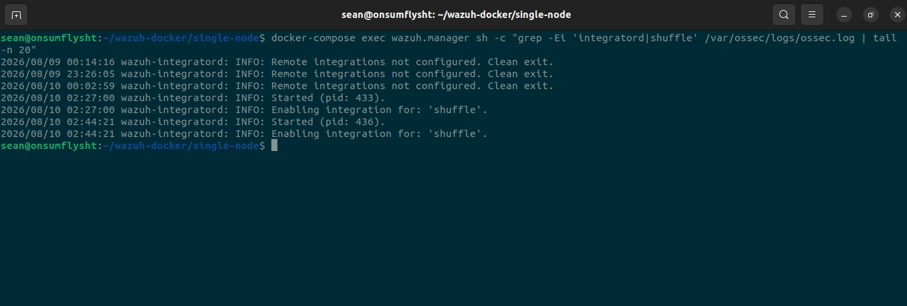

`wazuh-integratord` was verified running, confirming that the component responsible for forwarding matching alerts was active.

### Controlled Retest

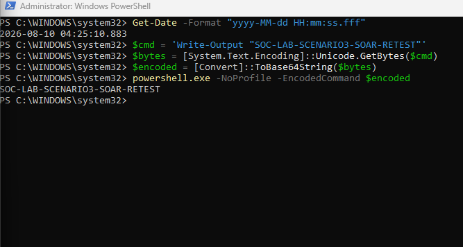

The encoded PowerShell test was executed again after validating the integration path. The retest created a fresh event specifically for end-to-end pipeline confirmation.

### Wazuh Retest Detection

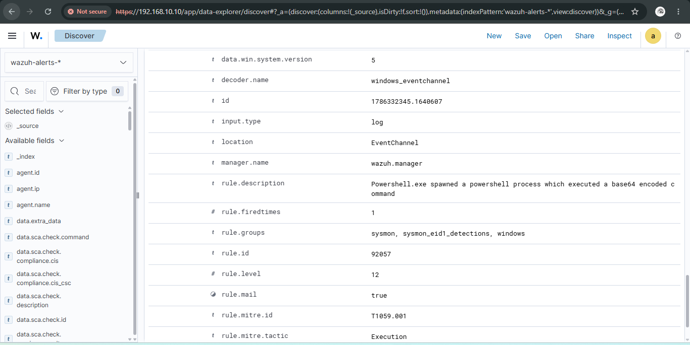

The fresh event again generated Wazuh Rule `92057`, establishing that the endpoint-to-SIEM portion of the chain was functioning during the SOAR retest.

### Shuffle Alert Ingestion

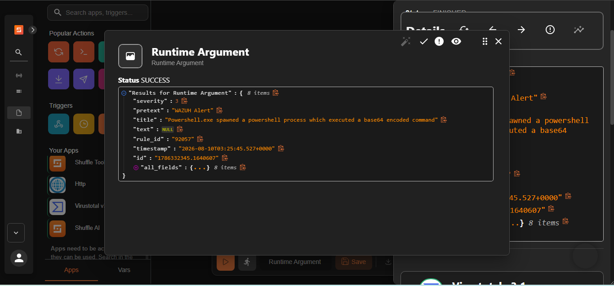

Shuffle received the Wazuh alert payload, including the Wazuh rule metadata, MITRE mapping, agent context, and Sysmon event data. This confirmed successful Wazuh-to-SOAR forwarding.

### Slack SOC Alert Delivery

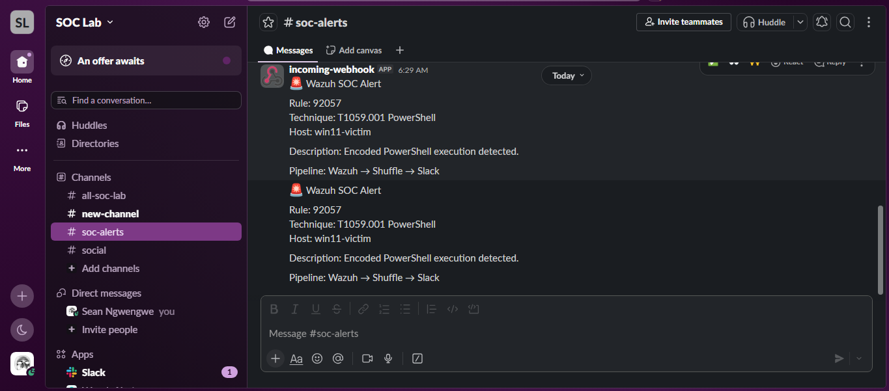

The workflow completed the final hop and delivered the alert into the Slack SOC channel. At this point the same controlled endpoint activity had been generated, collected, detected, forwarded, processed, and presented to an analyst-facing alert channel.

## End-to-End Evidence Chain

```text
Encoded PowerShell execution
        ↓
Sysmon Event ID 1 process telemetry
        ↓
Wazuh ingestion and Rule 92057 detection
        ↓
Shuffle webhook integration
        ↓
Workflow processing
        ↓
Slack SOC alert
```

Scenario 3 therefore validates more than a single detection. It demonstrates the operational chain from **endpoint telemetry → SIEM detection → SOAR forwarding → analyst notification**.

## Detection Engineering Finding

The scenario produced two distinct engineering observations.

First, the available telemetry is rich enough to identify `-EncodedCommand` usage even though the observed default Wazuh rule maps the process to `T1059.001` PowerShell. A higher-confidence custom rule could inspect process-creation telemetry for PowerShell combined with arguments such as `-EncodedCommand`, `-enc`, or other encoded-command variants, then map that behavior more specifically for local detection purposes.

Second, successful detection is only part of a production-like workflow. A rule that never reaches the analyst is operationally weaker than one whose forwarding path has been tested. By validating `wazuh-integratord`, retesting the event, confirming Shuffle ingestion, and verifying the Slack alert, this scenario tested the response plumbing as well as the detection itself.

## Incident Timeline

| Stage | Event |
|---|---|
| Baseline | Wazuh telemetry verified for the Windows endpoint |
| Simulation | Benign Base64 PowerShell command executed using `-EncodedCommand` |
| Hunting | Encoded PowerShell activity located in Wazuh Discover |
| Reconstruction | Full encoded command line reviewed in the event details |
| Detection | Wazuh Rule 92057, Level 3, mapped the process to T1059.001 PowerShell |
| Validation | Sysmon process-creation detail confirmed the endpoint execution context |
| Integration check | Wazuh Shuffle integration and `wazuh-integratord` verified |
| Retest | Fresh encoded PowerShell event generated |
| SIEM confirmation | Rule 92057 observed again during retest |
| SOAR confirmation | Shuffle received and processed the Wazuh payload |
| Analyst notification | Slack SOC alert successfully delivered |

## ATT&CK Coverage — Scenario 3

| Technique ID | Technique | Tactic | How it appears in this lab |
|---|---|---|---|
| T1059.001 | Command and Scripting Interpreter: PowerShell | Execution | Wazuh Rule 92057 and Sysmon PowerShell process telemetry |
| T1027 | Obfuscated/Compressed Files and Information | Defense Evasion | Base64-encoded command behavior demonstrated in the test command line; not claimed as the default Wazuh rule mapping |

## Analyst Takeaway

Scenario 3 joined threat hunting, detection engineering, and SOC operations into one workflow. The important result was not simply that PowerShell appeared in a SIEM. The evidence showed how an analyst could identify encoded execution, reconstruct the command from raw telemetry, verify the ATT&CK mapping Wazuh actually produced, diagnose the response path, and prove successful delivery to the final alerting channel.

---

# Consolidated ATT&CK Coverage

| Technique ID | Technique | Primary Scenario | Evidence Type |
|---|---|---|---|
| T1003.001 | OS Credential Dumping: LSASS Memory | Scenario 1 | Attempted Mimikatz credential access |
| T1546.011 | Application Shimming | Scenario 1 | Wazuh Rule 92058 + `sdbinst.exe` telemetry |
| T1105 | Ingress Tool Transfer | Scenario 1 | Wazuh Rule 92205 + PowerShell file-write telemetry |
| T1053.005 | Scheduled Task/Job: Scheduled Task | Scenario 2 | Atomic Red Team + Sysmon `schtasks.exe` telemetry |
| T1059.003 | Windows Command Shell | Scenario 2 | Wazuh Rule 92052 |
| T1059.001 | PowerShell | Scenario 3 | Wazuh Rule 92057 + Sysmon process telemetry |
| T1027 | Obfuscated/Compressed Files and Information | Scenario 3 | Encoded-command behavior demonstrated; no native T1027 Wazuh alert claimed |

---

# Lab Build

## Phase 0 — Environment Preparation

Disk-space constraints were resolved through partition growth using `growpart` and `resize2fs`. Docker permissions were corrected, and the Ubuntu manager's internal address was later made persistent with Netplan.

[Docker permissions fix](images/phase0/phase0_01_docker_permissions_fix.png)  
[Disk space resolved](images/phase0/phase0_02_diskspace_resolved.png)  
[Persistent Netplan configuration](images/phase0/phase0_03_static_ip_persistence.png)

## Phase 1 — Wazuh SIEM Deployment

The Wazuh 4.9.0 single-node manager, indexer, and dashboard stack was deployed on Ubuntu through Docker Compose.

[Docker stack healthy](images/phase1/phase1_01_docker_ps_healthy.png)  
[Wazuh dashboard live](images/phase1/phase1_02_dashboard_live.png)

## Phase 2 — Windows Endpoint and Sysmon

Windows 11 Enterprise LTSC was deployed with Sysmon using the SwiftOnSecurity configuration. The Wazuh agent was installed, configured for Sysmon ingestion, enrolled, and verified active.

[Wazuh agent active](images/phase2/phase2_03_agent_active.png)

## Phase 3 — SOAR Pipeline

A webhook-triggered workflow was built from Wazuh to Shuffle, with VirusTotal enrichment and Slack alerting. The initial pipeline was validated through a manual webhook test, and Scenario 3 later proved the same path with a real Wazuh detection payload.

[Shuffle workflow diagram](images/phase3/phase3_01_workflow_diagram.png)  
[Wazuh Shuffle integration](images/phase3/phase3_02_ossec_integration.png)  
[Shuffle run finished](images/phase3/phase3_04_shuffle_run_finished.png)

---

# Infrastructure Troubleshooting

## VirtualBox Networking Detour

Bridged networking proved unreliable on the host Wi-Fi connection, so the lab was redesigned around a dual-adapter layout. NAT provides internet access while `SOC-lab`, a VirtualBox Internal Network, handles VM-to-VM monitoring traffic.

A Windows routing issue initially sent internal traffic through the wrong interface. `Get-NetRoute` was used to diagnose the route selection, followed by an explicit route and interface-metric correction.

[Manual IP recovery](images/phase2/phase2_networking_01_manual_ip_fix.png)

## Monitoring Platform Recovery

Scenario 1 included recovery of a malformed Wazuh manager configuration that interrupted telemetry.

Scenario 3 included validation and recovery of the downstream Wazuh-to-Shuffle integration path before a successful end-to-end retest.

These failures were kept in the project because they demonstrate an important SOC reality: detection infrastructure itself must be monitored, investigated, and repaired.

---

# Repository Structure

```text
Detection-Engineering-and-Response-HL/
├── README.md
└── images/
    ├── phase0/
    │   ├── phase0_01_docker_permissions_fix.png
    │   ├── phase0_02_diskspace_resolved.png
    │   └── phase0_03_static_ip_persistence.png
    ├── phase1/
    │   ├── phase1_01_docker_ps_healthy.png
    │   └── phase1_02_dashboard_live.png
    ├── phase2/
    │   ├── phase2_networking_01_manual_ip_fix.png
    │   └── phase2_03_agent_active.png
    ├── phase3/
    │   ├── phase3_01_workflow_diagram.png
    │   ├── phase3_02_ossec_integration.png
    │   └── phase3_04_shuffle_run_finished.png
    ├── scenario1/
    │   ├── s1_01_services_running.png
    │   ├── s1_02_mimikatz_blocked.png
    │   ├── s1_02b_mimikatz_x64_attempt.png
    │   ├── s1_03_wazuh_mitre_mapping.png
    │   ├── s1_04_sdbinst_forensic_detail.png
    │   ├── s1_05_powershell_hunt.png
    │   ├── s1_06_t1105_ingress_tool_transfer.png
    │   ├── s1_07_agent_reconnect_recovery.png
    │   └── s1_08_raw_telemetry_volume.png
    ├── scenario2/
    │   ├── s2_01_atomic_module_ready.png
    │   ├── s2_02_t1053_005_test_catalog.png
    │   ├── s2_03_services_running_pretest.png
    │   ├── s2_04_wazuh_dashboard_pretest_baseline.png
    │   ├── s2_05_atomic_t1053_005_execution_success.png
    │   ├── s2_06_powershell_parent_process_hunt.png
    │   ├── s2_07_wazuh_t1059_003_command_shell_alert.png
    │   └── s2_08_schtasks_process_creation_detail.png
    └── scenario3/
        ├── s3_01_baseline_telemetry_verified.png
        ├── s3_02_encoded_powershell_execution.png
        ├── s3_03_wazuh_encoded_command_hunt.png
        ├── s3_04_encoded_commandline_detail.png
        ├── s3_05_sysmon_process_creation_detail.png
        ├── s3_06_wazuh_rule_92057_mitre_mapping.png
        ├── s3_07_shuffle_integration_loaded.png
        ├── s3_08_shuffle_integratord_enabled.png
        ├── s3_09_soar_retest_execution.png
        ├── s3_10_wazuh_rule_92057_retest.png
        ├── s3_11_shuffle_received_rule_92057.png
        └── s3_12_slack_soc_alert_received.png
```

---

# Project Outcome

The lab now demonstrates a complete blue-team workflow rather than a collection of disconnected screenshots:

**Build the monitoring stack → generate controlled adversary behavior → hunt the telemetry → validate the SIEM interpretation → identify detection gaps → troubleshoot failures → restore the platform → prove alert delivery.**

The three investigations intentionally preserve unsuccessful attacks, imperfect default detections, and infrastructure failures because those moments produced the strongest analyst work in the project.

## Next Engineering Iterations

Future improvements can focus on custom Wazuh rules for high-confidence `schtasks.exe /create` persistence and encoded PowerShell command lines, followed by rule testing, false-positive tuning, and reusable detection documentation.

---

*All evidence shown in this repository was generated inside the live lab environment rather than imported from pre-recorded datasets. ATT&CK mappings are described according to the observed behavior and the mappings actually produced by the lab; no alert is presented as something it did not detect.*
